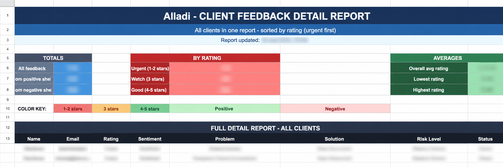

# AI-Powered Client Feedback Routing System

An n8n automation that reads client feedback from a Google Form, uses an AI model to analyze it (sentiment, risk level, root problem, suggested solution), and automatically routes it into organized Google Sheets — with a live dashboard summarizing everything.

Built as a portfolio project to demonstrate no-code automation + AI integration skills.

> **Note:** This is a practice/demo project. All company names, emails, and feedback shown in the screenshots and sample data are fictional ("Alladi" is a placeholder brand name, not a real client).

---

## 🧩 What Problem Does This Solve?

Imagine a company collects customer feedback through a simple Google Form. On a small scale, someone can read every response by hand. But once you get dozens or hundreds of responses, that becomes slow and inconsistent — one person might rate a comment "urgent," another might not.

This workflow automates that triage step. Every time someone submits the form:

1. It **reads the new response** automatically (no manual checking).
2. It **decides if it's positive or negative** feedback based on the star rating.
3. It sends the feedback to an **AI model**, which acts like a junior analyst — it reads the comment and writes up the sentiment, the core problem, a suggested solution, a risk level (is this client about to leave?), and a priority.
4. It **files the analysis** into the right spreadsheet tab (positive or negative).
5. A **dashboard tab** automatically keeps running totals, so anyone can see at a glance how many clients are happy, how many are at risk, and what the average rating is — without opening a single row of raw data.

---

## 🔁 How It Works (Architecture)

```
Google Form
     │  (client submits feedback)
     ▼
Google Sheets (Form_Responses tab)
     │
     ▼
Google Sheets Trigger  ──▶  fires when a new row is added
     │
     ▼
Switch node  ──▶  checks the star rating
     │
     ├── Rating ≥ 4  ──▶  "Positive" branch
     │                        │
     │                        ▼
     │                  AI Agent (Mistral Cloud Chat Model)
     │                  analyzes: sentiment, problem, solution,
     │                  risk level, priority
     │                        │
     │                        ▼
     │                  Code node (JavaScript)
     │                  parses the AI's text response into
     │                  clean, separate fields
     │                        │
     │                        ▼
     │                  Append row to "Positive Feedback" sheet
     │
     └── Rating < 4  ──▶  "Negative" branch
                              │
                              ▼
                        AI Agent (Negative) + Memory
                        (same kind of analysis, tuned for
                        complaints / risk of churn)
                              │
                              ▼
                        Code node (JavaScript)
                        parses the response
                              │
                              ▼
                        Append row to "Negative Feedback" sheet

     Both sheets feed into:
     ▼
Dashboard tab (Google Apps Script)
  → totals, urgency buckets (Urgent / Watch / Good),
    and average ratings — updated automatically
```

**Plain-English summary:** the Switch node is like a mail sorter — it looks at the rating and decides which pile (positive or negative) the feedback belongs in. Each pile has its own AI "reader" that summarizes what happened and what to do about it. The results land in two separate spreadsheet tabs, and a third tab (the dashboard) just counts and averages what's in those two piles.

---

## 🛠️ Tech Stack

| Tool | Role in this project |
|---|---|
| **n8n** | The automation platform that connects everything and runs the workflow |
| **Google Forms** | Collects raw client feedback |
| **Google Sheets** | Stores the raw responses, the positive/negative analysis, and the dashboard |
| **Google Sheets API** (via n8n's Google Sheets node) | Lets n8n read new form rows and write AI results back |
| **Mistral AI** (via n8n's Mistral Cloud Chat Model node) | The AI "brain" that reads each comment and writes the analysis |
| **n8n Code node (JavaScript)** | Takes the AI's free-text answer and splits it into clean columns (Sentiment, Problem, Solution, Risk Level, Priority) using regex |
| **Google Apps Script** | Powers the dashboard tab — counts totals, urgency buckets, and averages automatically whenever the sheet updates |

---

## 📸 Screenshots

### 1. The n8n Workflow Canvas


*The full automation, end to end: a new form row triggers the workflow, the Switch node routes it by rating, and each branch runs its own AI analysis before writing results back to Google Sheets.*

### 2. Raw Form Responses


*The raw incoming data — exactly what a client typed into the Google Form, before any AI processing happens.*

### 3. Positive Feedback Sheet (AI-Analyzed)


*Once the AI Agent processes a positive response, it adds structured columns — sentiment, the client's underlying request, a suggested next step, and a risk/priority rating — turning a free-text comment into something a team could act on immediately.*

### 4. Negative Feedback Sheet (AI-Analyzed)


*The negative branch flags at-risk clients clearly — for example, rows highlighted in red show clients the AI marked as "Critical" priority, meaning they're at real risk of churning if the issue isn't addressed.*

### 5. Live Dashboard


*The dashboard tab, generated by Google Apps Script, summarizes everything at a glance — no need to scroll through individual rows to know how the client base is feeling overall.*

---

## 🚀 Setup Instructions

You don't need to write any code to run this — just follow these steps.

### What you'll need first
- An **n8n** account (cloud or self-hosted) — [n8n.io](https://n8n.io)
- A **Google account** with access to Google Sheets and Google Forms
- A **Mistral AI API key** — you can get one at [mistral.ai](https://mistral.ai)

### Step 1: Set up your Google Sheet
1. Create a new Google Sheet.
2. Create these tabs (exact names matter, since the workflow refers to them):
   - `Form_Responses` — where your Google Form sends its answers
   - `Positive Feedback` — where positive AI-analyzed rows will land
   - `Negative Feedback` — where negative AI-analyzed rows will land
   - `Dashboard` — the summary tab
3. Copy your **Sheet ID** from the URL — it's the long string of letters/numbers between `/d/` and `/edit` in your sheet's URL.

### Step 2: Connect your Google Form to the sheet
1. Create a Google Form with the same questions shown in the screenshots (email, rating, what they liked, what could improve).
2. Link the form's responses to the `Form_Responses` tab of your sheet (Forms → Responses → Google Sheets icon).

### Step 3: Import the workflow into n8n
1. Open n8n and create a new workflow.
2. Click the **"..."** menu (top right) → **Import from File**.
3. Select `workflow.json` from this repo.
4. The nodes will appear on the canvas, but they won't work yet — you still need to plug in your own credentials (next step).

### Step 4: Add your credentials
The imported workflow has placeholder values instead of real credentials, so nothing leaks. You'll need to replace:

| Placeholder | What to replace it with |
|---|---|
| `YOUR_GOOGLE_SHEET_ID_HERE` | Your own Google Sheet ID from Step 1 |
| Google Sheets credential (shows as disconnected) | Your own Google account, connected via n8n's credential manager |
| Mistral Cloud Chat Model credential (shows as disconnected) | Your own Mistral API key, connected via n8n's credential manager |

To connect credentials in n8n: click on a node → click the credential dropdown → **Create New Credential** → paste in your API key or sign in with Google.

### Step 5: Set up the dashboard script
1. In your Google Sheet, go to **Extensions → Apps Script**.
2. Paste in the script from `apps-script/dashboard.gs` (included in this repo).
3. Save, then run it once manually to authorize it.
4. (Optional) Set up a time-based trigger in Apps Script so the dashboard refreshes automatically every few minutes.

### Step 6: Test it
1. Submit a test response through your Google Form.
2. In n8n, click **Execute workflow** (or activate the workflow so it runs automatically).
3. Check your `Positive Feedback` or `Negative Feedback` tab — you should see a new row with the AI's analysis.
4. Check the `Dashboard` tab — the totals should update.

---

## 📁 Repo Structure

```
ai-feedback-routing-system/
├── README.md
├── LICENSE
├── .gitignore
├── workflow.json                  ← the exported, credential-free n8n workflow
├── apps-script/
│   └── dashboard.gs                ← Google Apps Script code for the dashboard tab
├── sample-data/
│   └── sample-feedback.csv         ← fake demo feedback (safe to share publicly)
└── screenshots/
    ├── workflow-canvas.png
    ├── form-responses.png
    ├── positive-feedback-sheet.png
    ├── negative-feedback-sheet.png
    └── dashboard.png
```

---

## 💡 What This Project Demonstrates

- Building a multi-branch automation with conditional logic (Switch node)
- Integrating an LLM (Mistral) into a real workflow, not just a chatbot demo
- Parsing unstructured AI output into structured spreadsheet data
- Designing a lightweight reporting layer (dashboard) on top of automated data
- Thinking about security/privacy basics (scrubbing credentials, using placeholders, using demo data instead of real client info) before publishing work publicly

---

## 📄 License

This project is licensed under the MIT License — see [LICENSE](LICENSE) for details.
